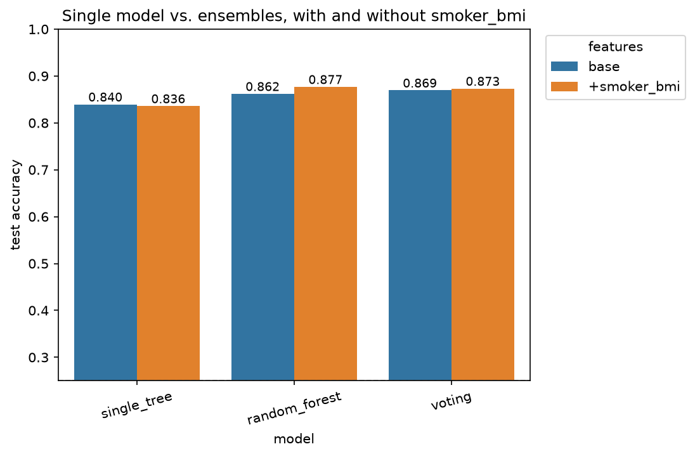
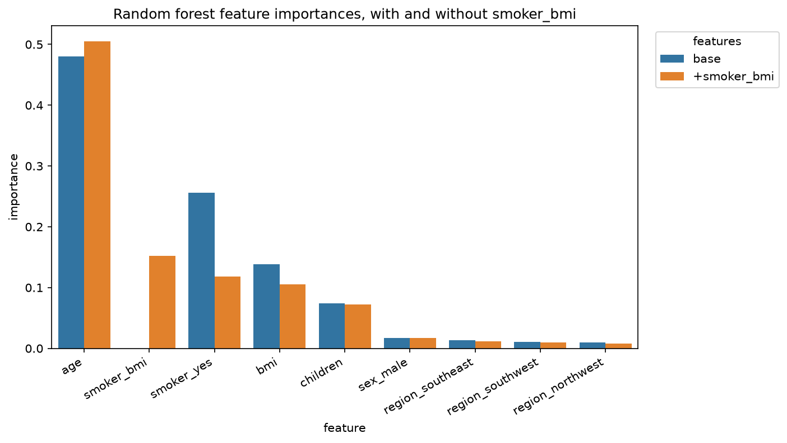

# Project Documentation

This site provides project documentation.
Use the documentation navigation to explore.

## How-To Guide

Many instructions are common to all our projects.

See
[⭐ **Workflow: Apply Example**](https://denisecase.github.io/pro-analytics-02/workflow-b-apply-example-project/)
to get the example projects running on your machine.

## Project Documentation Pages (docs/)

- **Home** - this documentation landing page
- [**Project Instructions**](./project-instructions.md)  - the standard project workflow
- [**Your Files**](./your-files.md) - how to copy the example and create your version
- [**Glossary**](./glossary.md) - project terms and concepts
- [**API**](./api.md) - autogenerated code documentation for the public project interface

## Phase 4. Technical Modification

I changed TARGET_COL from species to sex and renamed the logger to M05 Modification so the run is identifiable in project.log. I chose this because species is nearly separable from bill and flipper measurements, so all three models scored above 0.98 and the ensembles had no room to show a gain. Sex is a harder target and leaves error for them to work on.

I verified the change by rerunning the notebook top to bottom and reading project.log. Accuracy fell for every model, and the ensembles pulled further ahead of the single tree: the random forest gained 7.2 percent over it on sex against 1.4 percent on species, and gradient boosting gained 5.4 percent against no gain at all. The feature importance ranking reversed, with bill depth and body mass moving from last to first.

The change itself was easy, one constant and an updated summary. What it produced was not obvious in advance, which is the part that mattered.

## Phase 5. Custom Project

### Basis and Data

The example project used the Seaborn penguins dataset. I replaced it with a
medical insurance dataset of 1,338 individuals: age, sex, bmi, children, smoker,
region, and charges.

Source: Choi, M. (2018). Medical Cost Personal Datasets. Kaggle, ODbL v1.0.

I chose it because the earlier regression project left me with questions I wanted
to explore. The polynomial fit better than the linear model, and I suspected the
smoker-by-bmi interaction was the reason, but I had not tested it. This project
gave me a way to.

Limitations: the provenance is not fully documented. The dataset is also small,
and with only 268 test instances a single misclassification moves accuracy by
0.0037, so a difference that size is one person rather than a real difference
between models.

### Modeling Approach

This is a supervised classification problem. It is supervised because I chose a
target and the data carries labels for it. It is classification because the
target is a category, not a continuous number. Classification is the appropriate
approach because the question is which cost class an individual falls into, not
what their charges are in dollars.

I fit three models: a decision tree limited to depth 3 as a baseline, a random
forest of 200 trees at depth 10, and a soft-count voting classifier combining a
decision tree, a support vector machine, and a neural network.

The tree models need no feature scaling. The support vector machine and the
neural network inside the voting classifier do, so each was wrapped in a pipeline
with StandardScaler.

### Target

The example predicted `species`, a category already in the data.

I predicted `charge_class`, which I created by binning `charges` into quartiles
labeled low, moderate, high, and very high. Boundaries fell at $4,740, $9,382,
and $16,640, giving four classes of 335, 334, 334, and 335.

Binning changed the problem from regression to classification, so accuracy and
F1 replace R-squared and RMSE. It also changed what an error means. A regression
model that misses by $200 is close. A classification model that puts someone in
the wrong bracket is wrong, however near the boundary the case fell.

The classes are ordered but accuracy treats every error alike, so predicting
"low" for a "very high" case counts the same as predicting "moderate" for a
"high" one. The confusion matrix is what shows the difference.

### Features

The example used four numeric measurements.

I used age, bmi, and children, plus sex, smoker, and region one-hot encoded with
drop_first, for eight base features. Charges was excluded, since the target was
derived from it.

I added one engineered feature, smoker_bmi, the product of smoker_yes and bmi.
In the earlier regression project a degree-2 polynomial fit this data better than
a linear model and the scatter plots showed smokers separating by bmi, so the
hypothesis was that the smoker-by-bmi interaction was doing the work. A degree-2
polynomial adds every squared and product term at once, so that was an inference,
not an isolated result.

Rather than replace the base feature set, I kept both feature sets. Each of the
three models was fit twice, once on the eight base features and once on the same
eight plus smoker_bmi, using the same train and test split both times. That gives
six runs, and the only difference within each pair is that one column.

### Evaluation and Results

Every model was scored on a stratified test set of 268 instances using accuracy,
weighted precision, weighted recall, weighted F1, a confusion matrix, and the gaps
between train and test on both accuracy and F1.

The best model is the random forest with smoker_bmi at 0.8769 accuracy and 0.8748
F1, against 0.8396 and 0.8397 for the single tree on the base features. That is
33 errors instead of 43. Random guessing on four balanced classes scores 0.25.
Both ensembles beat the single tree on both feature sets, on accuracy and F1.

The interaction feature helped the random forest most at +0.0149, helped the
voting classifier slightly at +0.0037, and cost the single tree 0.0037.

The random forest's top features on the +smoker_bmi run are age at 0.505,
smoker_bmi at 0.152, and smoker_yes at 0.118. Age leads in the base run as well,
at 0.481 against 0.256 for smoker_yes, so the engineered feature did not create
that ordering. Adding smoker_bmi drew almost entirely from smoker_yes, which fell
0.138, while bmi fell only 0.032. In the regression project smoking dominated the
coefficients, but a coefficient measures dollars per unit of a feature and an
importance measures how much the forest relied on a feature, so the two are not
directly comparable.

Limitations. All six runs share one train and test split, so nothing here
separates a real gain from a favorable split. I cannot measure what 200 trees
cost against one, so I cannot say whether the gain justifies the complexity. The
confusion matrix shows a pattern accuracy hides: of the best model's 33 errors,
25 place someone in a lower cost class than they belong in and only 8 place them
higher. The "very high" class is the weakest, with 49 of 67 correctly identified.

### Summary

I converted a regression dataset into a four-class classification problem,
compared a single decision tree against two ensembles, and tested one engineered
interaction feature by fitting every model twice.

The random forest with the interaction feature performed best. The ensembles beat
the single tree every time, by modest margins.

I learned how different ensemble models work. A random forest is many copies of
one model type, made to differ by training each tree on random subsets of rows
and features. A voting classifier is two or more different model types fit on the
same data. Each ensemble is built to produce members whose errors are as
independent as possible, since a model that is wrong on a given instance can be
outvoted by the others only if they are not wrong in the same place. The two
ensembles do this by different routes, one by varying the data and the other by
varying the model type. Building both showed me they can land in nearly the same
place: 0.8769 and 0.8731.

What I do not know: whether the ensembles' small advantage over the single tree
would survive a different split. The project left me with more to try than it
answered: other model types, repeated splits, hyperparameter changes, additional
feature engineering, and feature selection.

These skills apply to any problem with a categorical outcome and mixed numeric
and categorical predictors. An early-alert model predicting whether a student is
on track in a developmental math course would have the same shape: a readable
baseline to show faculty, ensembles to test whether accuracy improves enough to
justify a model no one can inspect, and feature importances to indicate which
measures carry information.

